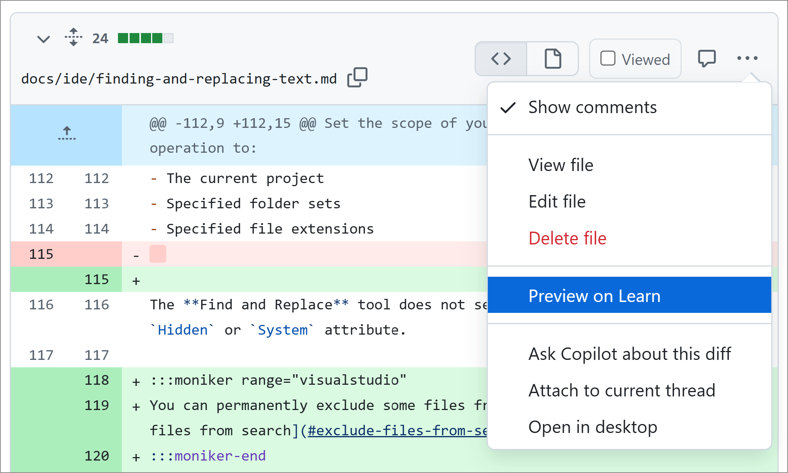

# Preview on Learn extension for Microsoft Edge

This Microsoft Edge extension is for contributors to docs on <https://learn.microsoft.com>. It adds a direct link from each file in a GitHub pull request to its preview on <https://review.learn.microsoft.com>.

## Install

1. Install the extension from [Microsoft Edge Add-ons](https://microsoftedge.microsoft.com/addons/Microsoft-Edge-Extensions-Home).
1. Add a personal access token (PAT) so the extension can authenticate to GitHub and obtain information about the repo, such as pull request status.

   1. Select **Extensions** > **Preview on Learn**.

      

   1. Follow the steps to create a PAT with *repo* scope, copy the token, then configure it for single sign-on (SSO).

      

   1. Paste in the copied token and select **Save token**.

## Usage

To use the extension:

1. Navigate to the **Files changed** tab of any pull request in a GitHub repo that publishes to <https://learn.microsoft.com>.
1. Select the kebab (**...**) menu on the top-right of any file that's listed in the pull request.
1. Select **Preview on Learn**.

   A new browser window opens to a preview of the file on <https://review.learn.microsoft.com>.

## Feedback

Please send any feedback to Genevieve Warren at Microsoft.
